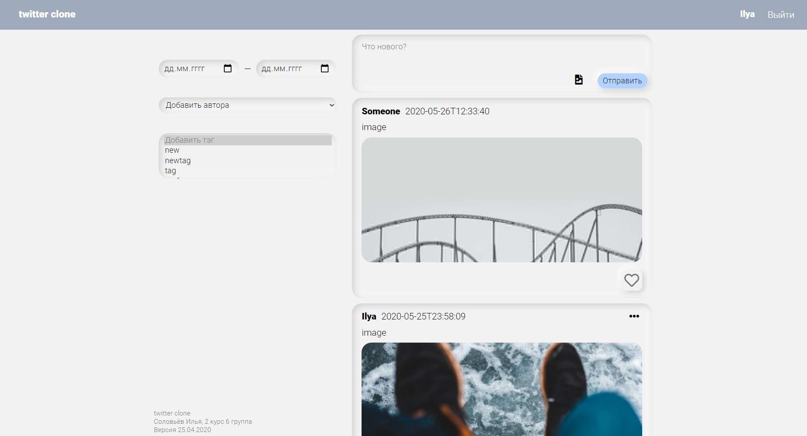

# Twitter Clone

## Description
Twitter-like social network build with mentorship from [Exadel](https://www.exadel.com/) employees. 
### Technologies
**Frontend**: pure HTML, CSS, ES6 Javascript \
**Backend**: Java Servlets, MySQL
### Features
- Unique neumorphic design done in Figma
- Single page application
- Authorization
- Adding/editing/deleting posts with tags and images
- Filtering by date, author and tags

[Technical Specification](https://docs.google.com/viewer?a=v&pid=sites&srcid=ZGVmYXVsdGRvbWFpbnxmYW1jc2JzdXxneDoxM2ZiZjY4Njg3ZDg3YmE0)
## Design
[Desktop](https://www.figma.com/proto/nhzOF0wcDUAtvPks79FWJO/UP?node-id=48%3A111&viewport=-724%2C478%2C0.4324769973754883&scaling=min-zoom)
/ [Mobile](https://www.figma.com/proto/nhzOF0wcDUAtvPks79FWJO/UP?node-id=69%3A177&viewport=120%2C327%2C0.23931360244750977&scaling=scale-down)
## Twitter Clone API
Request | Method | URL | Body | Success | Failure
---------|----------|------|--------|---------|--------
Add post | POST | `/tweets` | JSON | 200 + JSON | 400
Delete post | DELETE | `/tweets?id=` | none | 200 | 400
Edit post | PUT | `/tweets` | JSON | 200 + JSON | 400
Filter | POST | `/tweets/search` | JSON | 200 + JSON | 200 + Empty array
Like | POST | `/tweets/like?id=&author=` | none | 200 | 400
Login | GET | `/tweets/login?username=` | none | 200 | 404
Get post | GET | `/tweets?id=` | none | 200 + JSON | 404
Get all authors | GET | `/tweets/authors` | none | 200 + JSON | 500
Get all tags | GET | `/tweets/tags` | none | 200 + JSON | 500
Load image | POST | `/image` | file | 200 + filename | 400

Postman requests collection: https://pastebin.com/8X8430v9
